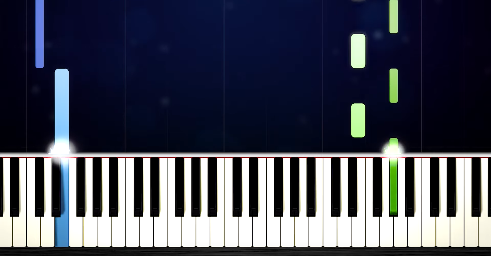

# convert-yt-to-midi
You don't have to pay 20 euro for every piano song in MIDI, just make it by yourself from any YT piano tutorial.

All you have to do is to find any piano tutorial on YT where keys are highlited when pressed, then:

1. in `main.py` set var `START_VIDEO` [`int` in seconds] after intro, when actual song starts, `END_VIDEO` [`int` in seconds] at the end of the song, before outro and `VIDEO_LINK` [`str`] of the YT video.
2. `pip install -r requirements`
3. run `main.py` by `python3 main.py` or manually in the IDE

YT video will be saved in the `./videos/MyVideo.mp4` and `.mid` file will be saved in `./` as `out.mid`